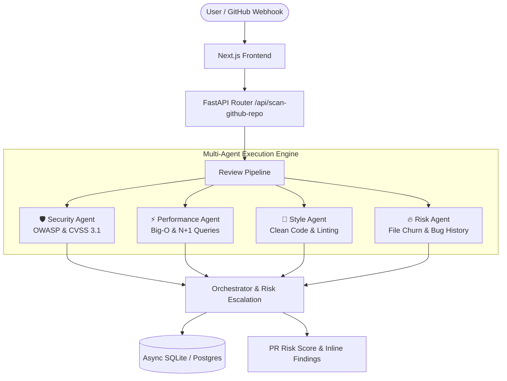

# 🛡️ SentinelReview

> **Autonomous Multi-Agent Code Review & PR Triage Engine powered by Google Gemini AI**

[](https://sentinnelcodereview-frontend.onrender.com)
[](https://github.com/shreyaaaah/sentinnelcodereview)
[](LICENSE)

---

## 🚀 Live Demo

- **Frontend Application**: [https://sentinnelcodereview-frontend.onrender.com](https://sentinnelcodereview-frontend.onrender.com)
- **Instant Scan Endpoint**: [https://sentinnelcodereview-frontend.onrender.com/scan](https://sentinnelcodereview-frontend.onrender.com/scan)
- **Backend API**: `https://sentinnelcodereview-backend.onrender.com`

---

## ✨ Overview

**SentinelReview** is an AI-powered code review and triage engine that performs deep multi-agent analysis on standalone code, uploaded source files, and public GitHub repositories or Pull Requests.

Instead of generic static analysis, SentinelReview coordinates specialized AI agents working in parallel to detect security vulnerabilities, performance bottlenecks, style violations, and historical file risk.

---

## 🤖 Multi-Agent Architecture



### Agents Breakdown

1. **🛡️ Security Agent**:
   - Scans for OWASP Top 10 vulnerabilities (SQL Injections, Command Injections, Hardcoded Secrets, Unsafe Evaluations).
   - Generates formal **CVSS 3.1 Vector Strings** and Severity Ratings (Low, Medium, High, Critical).

2. **⚡ Performance Agent**:
   - Detects algorithmic inefficiencies (nested loops $O(n^2)$, $O(n^3)$ complexity).
   - Flags N+1 database query patterns inside loops and unindexed queries.

3. **🎨 Style & Clean Code Agent**:
   - Evaluates function length, cyclomatic complexity, docstring presence, and naming conventions.
   - Recommends refactoring improvements.

4. **🔥 Historical Risk Agent**:
   - Analyzes file churn and past bug-fix commit frequency using git blame analysis.
   - Dynamically **escalates finding severity** for high-risk files.

---

## 💻 Input Capabilities

- **Instant Code Paste**: Paste raw code snippets in Python, JavaScript, TypeScript, C++, Go, Java, etc.
- **File Upload**: Upload source files (`.py`, `.js`, `.ts`, `.cpp`, `.go`) directly.
- **GitHub Repository / PR / Single File URLs**:
  - Scan full GitHub repositories (e.g. `github.com/owner/repo`).
  - Scan specific GitHub Pull Requests (e.g. `github.com/owner/repo/pull/123`).
  - Scan single file blob URLs (e.g. `github.com/owner/repo/blob/main/path/to/file.py`).

---

## 🛠️ Tech Stack

### Frontend
- **Framework**: Next.js 14 (App Router, React, TypeScript)
- **Styling**: TailwindCSS with dark glassmorphism aesthetic
- **Charts & Visualization**: Recharts, Lucide Icons

### Backend
- **Framework**: FastAPI (Python 3.11+)
- **Database**: SQLAlchemy (Async), SQLite / PostgreSQL
- **Git Mining**: PyDriller, HTTPX raw scraper (Zero rate-limit fallback)
- **AI Models**: Google Gemini 1.5 Flash / Gemini 3.6

---

## 📁 Repository Structure

```
sentinnelcodereview/
├── backend/
│   ├── app/
│   │   ├── agents/          # Security, Performance, Style, & Risk agents
│   │   ├── db/              # Database models & async sessions
│   │   ├── git_mining/      # Git blame & churn analysis
│   │   ├── ingestion/       # Unified diff parser & semantic chunker
│   │   ├── rag/             # RAG context retriever
│   │   ├── routers/         # FastAPI endpoints (/api/scan-code, /api/scan-github-repo)
│   │   └── services/        # Review pipeline orchestrator
│   ├── Dockerfile
│   └── requirements.txt
├── frontend/
│   ├── app/
│   │   ├── dashboard/       # Team Quality Overview dashboard
│   │   ├── lib/             # API routing helper (getApiUrl)
│   │   ├── pr/[id]/         # Detailed PR review & annotations page
│   │   ├── risk-heatmap/    # Historical file risk heatmap
│   │   └── scan/            # Standalone scan & GitHub repo analyzer
│   ├── Dockerfile
│   └── package.json
├── docker-compose.yml
└── render.yaml              # Render multi-service deployment spec
```

---

## ⚙️ Local Setup Instructions

### Prerequisites
- Python 3.10+
- Node.js 18+
- Git

### 1. Clone Repository
```bash
git clone https://github.com/shreyaaaah/sentinnelcodereview.git
cd sentinnelcodereview
```

### 2. Backend Setup
```bash
cd backend
python -m venv venv
# On Windows:
venv\Scripts\activate
# On Linux/macOS:
source venv/bin/activate

pip install -r requirements.txt
```

Create a `.env` file in `backend/`:
```env
GEMINI_API_KEY=your_gemini_api_key_here
DATABASE_URL=sqlite+aiosqlite:///./sentinel.db
```

Start the FastAPI server:
```bash
uvicorn app.main:app --reload --port 8000
```

### 3. Frontend Setup
```bash
cd ../frontend
npm install
npm run dev
```

Open [http://localhost:3000](http://localhost:3000) in your browser.

---

## 🐳 Docker Setup

Run the entire backend, frontend, PostgreSQL, and Redis stack with Docker Compose:

```bash
docker-compose up --build
```

---

## 📄 API Endpoints

| Method | Endpoint | Description |
| :--- | :--- | :--- |
| `POST` | `/api/scan-code` | Scan raw code snippet or file upload |
| `POST` | `/api/scan-github-repo` | Scan GitHub repo, PR, commit, or single file blob |
| `GET` | `/api/dashboard-overview` | Retrieve team quality trends & recent scans |
| `GET` | `/api/risk-heatmap-latest` | Retrieve historical file risk matrix |
| `GET` | `/api/prs/{pr_id}` | Fetch detailed review findings for a specific PR |

---

## 📜 License

This project is licensed under the [MIT License](LICENSE).
